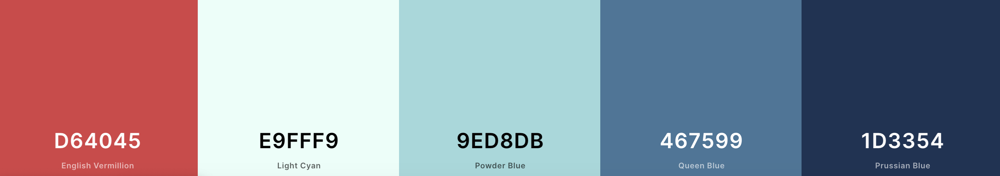

# Kiss my assthma
### "Because it's not just asthma..."
This website has been created to make people aware whilst educating them. Asthma is a condition that not many know about so the aim of this site was to build a community where it gives confidence. The site has a continued clean and flat design whilst being user friendly and interactive. Before creating the design and website a business strategy map was created. This allowed us to see the purpose, future, distribution and marketing channels along with competitors and competitive stategies; before finding a suitable design and website. 

Hosted on GitHub and GitHub Pages
Created by Amelia Bultitude

# UX
(insert image from am i responsive at finish)

## Users
The expected user of this website could be an any aged, male/female, chronic asthma sufferer or friends and family of those. They will be from any English reading countries, online who are seeking advice and personal knowledge.
## User Stories
* A sufferer of chronic asthma looking for a community and/or support.
* Friends/Family that know someone who suffers and would like more understanding.
* Researchers looking for understanding and personal, real like experience. 
## Design 
* Color Scheme chosen is made up of five colours. 
    * #d64045
    * #e9fff9
    * #9eb8db
    * #467899
    * #1d3354

* Custom Design Logo created with independent sources.
* Montserrat Subrayada used for heading and Montserrat used for text throughout.
    * font-family: 'Montserrat', 'Montserrat Subrayada', sans-serif

## Mock Ups
* Mock Ups were created on a [Figma](www.figma.com) and can be see [here](https://www.figma.com/file/1Klny9yq9t9i2M158QC8vx/Untitled?node-id=0%3A1).
* The website has four main pages, all internally linked.

# Features 
Features planned, implimented and outlined for later development.
## Planned Features 
* README file 
* Mock Ups
* Page Refreshes? 
* Color Scheme
* Custom Logo
* Jasmine Testing
* Bootstrap - HTML CSS and JAVASCRIPT 
    * Grid System 
* Responsive Design
    * Mobile First
* UX Elements
    * User Flow 
    * Animations 
    * Transitions
* Accessibility
* GitHub
    * Remote Repository
* Deployed
    * Hosted on GitHub Pages
