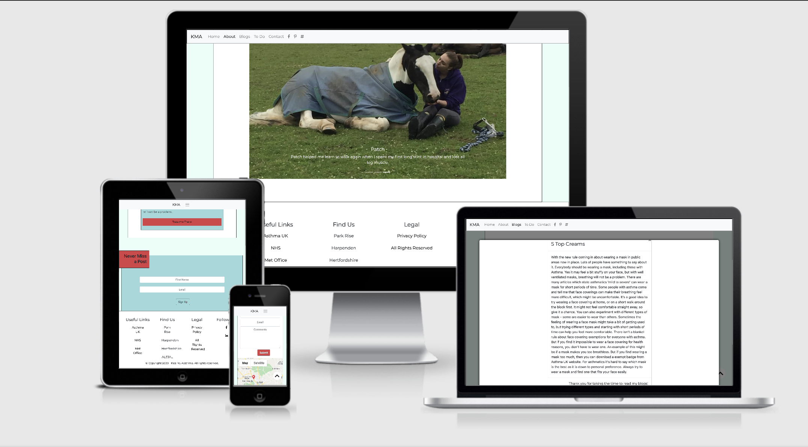
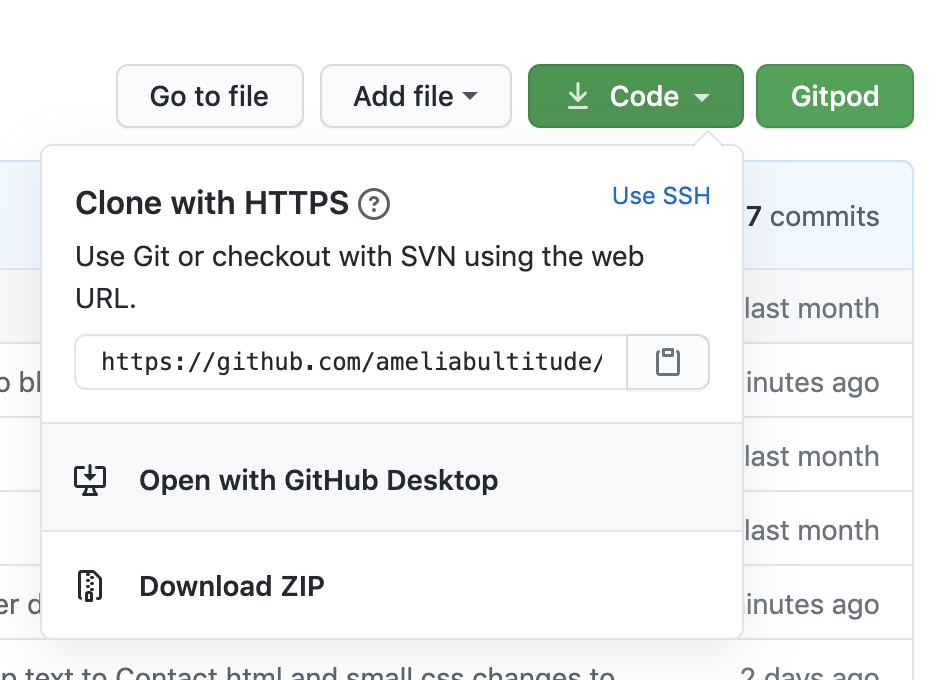
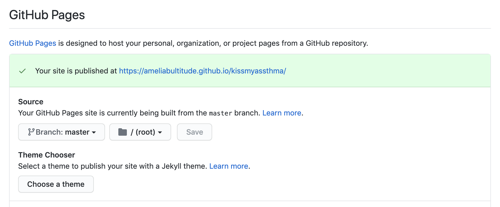
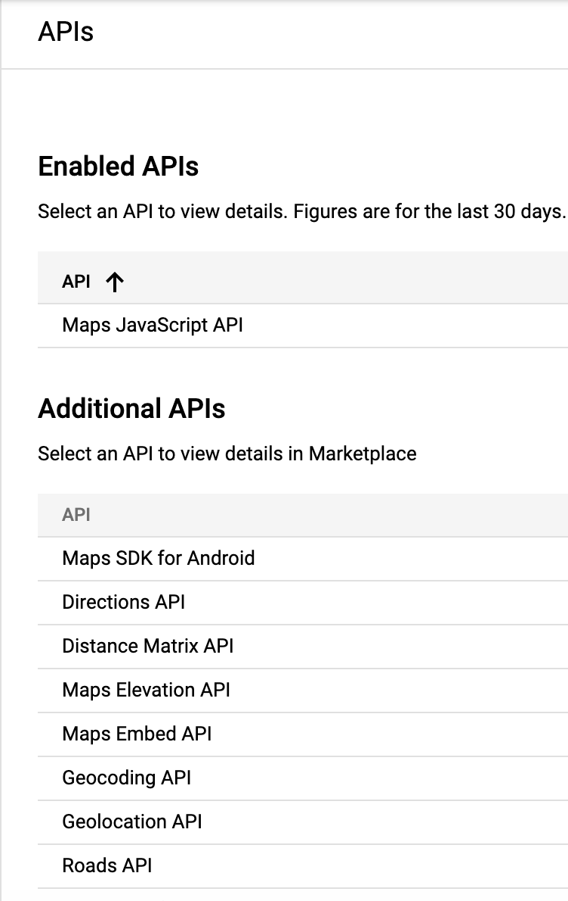
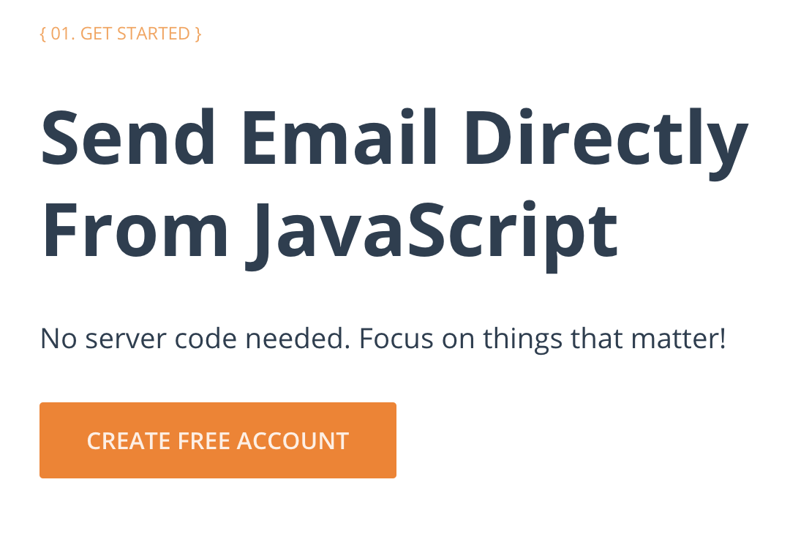

# Kiss my assthma
### "Because it's not just asthma..."
This website has been created to make people aware whilst educating them. Asthma is a condition that not many know about so the aim of this site was to build a community where it gives confidence. The site has a continued clean and flat design whilst being user friendly and interactive. Before creating the design and website a business strategy map was created. This allowed us to see the purpose, future, distribution and marketing channels along with competitors and competitive stategies; before finding a suitable design and website. Kiss my assthma was designed to have two S's as aposed to one. This comes with a light hearted pun which was thought to bring laughter to those who may be struggling with this condition. 
This project is the second in the milestone projects that make up the Full Stack Developer Course. The focus was ensuring the website was interactive and responsive, using javascript to better the website functionality.
[Click Here to see the site live](https://ameliabultitude.github.io/kissmyassthma/)

Hosted on GitHub and GitHub Pages
Created by Amelia Bultitude

# UX

## Design Process
1. Discovery - I always knew that the main focus of this site was to inform others on the severity of this condition and offer support for those who may be going through the same thing. I wanted the site to be user friendly and easy to use for a variety of users. As I have just started my learning of JavaScript and this was my first project containing it, I wanted to use it to allow more interactiveness. Ensuring I designed JavaScript into my wireframe was paramount. I began with starting the UX design process by creating my User Stories which can be seen below, as these stories allowed me to develop accordingly.

2. Strategy Plan - Once I had decided on my main aims throughout the project, I then focussed on planning my Key Features I wanted to include in my website. I made a list on all the JavaScript I wanted to include on my pages, this included any experimental implimentations. This list allowed me to decide on some Key Features : a To Do list, allowing users to create and edit their own list. Google Maps API, allowing users to see pointers of locations. A Sign Up form to allow updates to be recieved and a Contact Form with a response email.
From thinning my ideas down into a list of features to include, I was able to then begin my Visual Design Process.

3. Visual Design - I began to create the wireframes and structure of the design into 5 seperate pages: 'Index', 'About', 'Blog', 'To Do' and 'Contact'. The pages worked well into the disovery process, as 'Index' allowed users to come onto the website and navigate their way around, seeing newest blog post and allowing them to sign up. From there the user can navigate their way to the next page, 'About'. On this page they will have the same navigation choices from 'Index', it will allow them to read facts and view the first image carousel. Navigating to the next page 'Blogs', will allow several boxes on a page allowing the opening of modals. Through to 'To Do', will allow users to create their own to do list, and edit/add/remove input. Finally, to round the page off 'Contact' , this will allow users to see Google Maps pointers and contact the company if they need. Every page will be navigatable through the responsive navbar, and an internal button. 

4. Production -  As mentioned in previous points, I will use a responsive navbar for main navigation and an internal button. I will use bootstrap to allow proper responsive implimentation. Once I used figma for my design process on my wireframes, [which can be seen here](https://www.figma.com/file/1Klny9yq9t9i2M158QC8vx/Kiss-my-assthma?node-id=0%3A1). Once I had made the base structure on Figma, I decided on a color scheme, for this I used [Coolors](https://coolors.co/), this helped me decide on five colors to use throughout my website. When deciding a color scheme, it is important to think about where each color could go. 
* The Red (#d64045) is used for buttons and smaller boxes. 
* The Dark Blue (#1d3354) is used for headings. 
* The Medium Blue (#467899) is used for boxes and background colors.
* The Light Blue (#9eb8db) is again used for boxes. 
* The Lighest Blue (#e9fff9) is used for margin boxes in the background.

I then went over to [Google Fonts](https://fonts.google.com/) where I decided on my two fonts to use throughout my website. For user friendly purposes, it is good to ensure these two fonts are compatible and easily readable. They need to maintain a professional standard to users trust the content. 

Once my wireframes had be compeleted on figma, I opened up a repository on GitHub, this is where I began development. This repository can be seen on this [link here](https://github.com/ameliabultitude/kissmyassthma). I created the standard HTML structure of a website, with a few elements coming from bootstrap. I then created a css file, to begin designing. Once designing was underway, I began on my JavaScript files. 

## Main aims
* To offer support and reassurance for other people going through the same problems and conditions.
* To teach others the seriousness of the condition.
* To create a safe place and community for people.
* To create a fully responsive website on computers and mobile devices and implimenting Javascript. 
* To create an easy useable and navigational website for all users.
## Users
The expected user of this website could be an any aged, male/female, chronic asthma sufferer or friends and family of those. They will be from any English reading countries, online who are seeking advice and personal knowledge.
* A sufferer of chronic asthma looking for a community and/or support.
* Friends/Family that know someone who suffers and would like more understanding.
* Researchers looking for understanding and personal, real like experience. 
## User Stories
This project has multiple user stories, these can be for existing users and new users. Users may be using computers, tablets or mobile devices. 
### New Users 
* I am a user who has never understood the seriousness of asthma. 
* I am a user who has asthma myself, and would like a community. 
* I am a user who would like to learn more to help others.
* I am a user who would like to use this site to teach others.
### Existing Users
* I am a user who has been using the site for knowledge.
* I am a user who has been using the site for support for others.
* I am a user who has used this site for mental support.
### Mobile Device / iPad Users
* I am a user who does not own a computer, I will only be viewing on max screen size a tablet. I would like the site to be fully functional and UX Friendly. 
## Design 
* Color Scheme chosen is made up of five colours. 
    * #d64045
    * #e9fff9
    * #9eb8db
    * #467899
    * #1d3354

* Custom Design Logo created with independent sources.
* Montserrat Subrayada used for heading and Montserrat used for text throughout.
    * font-family: 'Montserrat', 'Montserrat Subrayada', sans-serif

## Mock Ups
* Mock Ups were created on a [Figma](www.figma.com) and can be see [here](https://www.figma.com/file/1Klny9yq9t9i2M158QC8vx/Untitled?node-id=0%3A1).
* The website has four main pages, all internally linked.

# Features 
This outlines the features used on each page and the features used on every page. 
## Consistent through out site
* Hamburger Responsive Navbar
* Responsive Footer
* Margin Box
* Back to top button
## Index
* Sign up form
* Featured box
* EmailJS linked
* Popup text
## Blogs
* Boxes of blogs to choose from and read
* Modal Boxes onclick()
* Photo Viewer (js)
## Contact
* Contact form
* Google Maps with pointers
* Popup text
* EmailJS linked
## About
* Image
* Four boxes of surrouding text
* Carousel 
## To Do 
* Using JS a todo list allowing adding and deleting independently
## Features Left To Impliment
* Styled Modals
* Image Viewer in blogs.

## Planned Features 
* README file 
* Mock Ups
* Page Refreshes? 
* Color Scheme
* Custom Logo
* Jasmine Testing
* Bootstrap - HTML CSS and JAVASCRIPT 
    * Grid System 
* Responsive Design
    * Mobile First
* UX Elements
    * User Flow 
    * Animations 
    * Transitions
* Accessibility
* GitHub
    * Remote Repository
* Deployed
    * Hosted on GitHub Pages
* Google Maps API
* JS Modals
* JS Hamburger Navbar
* To Do list (javascript)
* Image Viewer on blogs
* Popup text
* EmailJS
* Back to Top button

# Technology/Sites used
## Languages 
* [HTML](https://www.w3schools.com/html/) - 
    * The language HTML was used for structure.
* [CSS](https://www.w3schools.com/css/)-
    * The language CSS was used for design.
* [JAVASCRIPT](https://www.w3schools.com/js/default.asp) - 
    * The language JS was usedfor interactivity.
## Developer tools
* [Google Chrome](https://developers.google.com/web/tools/chrome-devtools) -
    * Chrome was used for developer tools and as a viewing browser.
* [Firefox](https://developer.mozilla.org/en-US/docs/Tools) -
    * Firefox was used for developer tools and as a viewing browser
## Additional
* [Safari](https://www.apple.com/uk/safari/) -
    * Safari was used as a viewing browser.
* [Google](https://www.google.co.uk/) -
    * Google was used throughout development for research.
* [Bootstrap](https://getbootstrap.com/) -
    * Bootstrap was used for the grid system and the HTML, CSS and  JAVASCRIPT frameworks.
* [Visual Studio Code](https://code.visualstudio.com/) - 
    * VS Code IDE was used for overall development.
* [GitHub](https://github.com/) - 
    * GitHub was used to host the repository.
* [GitHub Pages](https://pages.github.com/) -
    * GitHub Pages allowed for the website to be hosted.
* [Google Fonts](https://fonts.google.com/) -
    * Google Fonts were used for importing design fonts throughout the website.
* [Font Awesome](https://fontawesome.com/) - 
    * Font Awesome were used for importing icons in throughout the website.
* [Slack](https://slack.com/intl/en-gb/) - 
    * Slack was used as community forum for help and support if and when needed.
* [Am I Responsive](http://ami.responsivedesign.is/) - 
    * Am I Responsive was used for testing the responsiveness of the website.

# Testing 
Throughout my project, I put my site through many tests to ensure it worked correctly. The tests I ran are explained further on another page.

[Please Click Here To See](testing.md)

# Users
The expected audience of this site are any gender, they will be most likely be in close contact with others or dealing themselves with severe brittle asthma. 
* Family and Friends who have a close person dealing with brittle asthma and are looking for support/advice and a community.
* An individual looking for a community and support from others going through the same thing.
* A person who would like to learn more about asthma from a personal aspect.
* A researcher looking for a personal view and take on asthma. 

# Bugs During Development
* Bugs
    * Nav would not spread over the whole width of the page. 
* Solution
    * The use of Bootstrap and fixing the nav into 'sticky' ensured the nav fitted the screen.
* Bugs
    * Never Miss a Post Box floating right on mobile making width of mobile view too wide.
* Solution
    * The use of bootstrap coloumns and adjusting the email box
* Bugs
    * The Modal would not open.
* Solution
    * Use of J-Query format allowing modal box to open.
* Bugs
    * Heading and Sub heading appearing under carousel not on the images.
* Solution
    * Use of Bootstrap allowed the heading and sub heading to appear on the carousel. 
* Bugs
    * Trialling out a new button for go to top, isn't appearing at all.
* Solution
    * Changing javascript to call different ids.
* Bugs
    * About page, image and text not aligning as designed.
* Solution
    * Use of Bootstrap grid system. 
* Bugs
    * Blog Hamburger Nav Error
* Solution
    * Syntax error.
* Bugs
    * Unable to edit text inside modal.
* Solution
    * There is most probably simple javascript to fix this error, but personally I will need further knowledge and practice in javascript.

# Deployment 

## Cloning Projects
Some users may wish to clone a project, this is done if they would like to make their own changes, this can be done by...
1. At the top of the repository page there is a button which says "code", this drops into a drop down where you can open in GitHub or copy over a link. 

2. Once the Terminal is open, you would then change the working directory to a location of your choice for the clone. 
3. Add 'git clone' into the URL. Press Enter.

## GitHub Deplopyment
To allow my project to be viewed by others, I took the following steps
1. On GitHub, their internal navigation allowed me to go onto [settings](https://github.com/ameliabultitude/kissmyassthma/settings).
2. Once in the settings tab, I scrolled down to the GitHub Pages section.
3. On this section, you can select 'Master Branch' for the source.
4. This ensured others could see my pages on live updates.

## Google Maps Deplopyment
This allowed me to use an API. I merged it into my HTML for the map to be seen on my site.
1. Using ['Getting Started with Google Maps Platform'](https://developers.google.com/maps/documentation/javascript/overview) I was able to set up an account.
2. After I created an account, I then was able to create an API Key and set the preferences and restrictions for it. 
3. This process can be copied for others to intregrate google maps into their html.

## Email JS
EmailJS is used to automatically send me an email each time a user signs up to our page or contacts with comments. The user will also recieve an email response. This can be done by..
1. Creating an account with EmailJS, choosing your plan. Personally I stayed with the free account, this allows 200 emails per month. 
2. Following steps on their tutorials allowes you to create a template and add in EmailJS script into your project head. 
3. EmailJS is now intregrated into your project and can be used. This also works on deploying projects who use EmailJS. 
