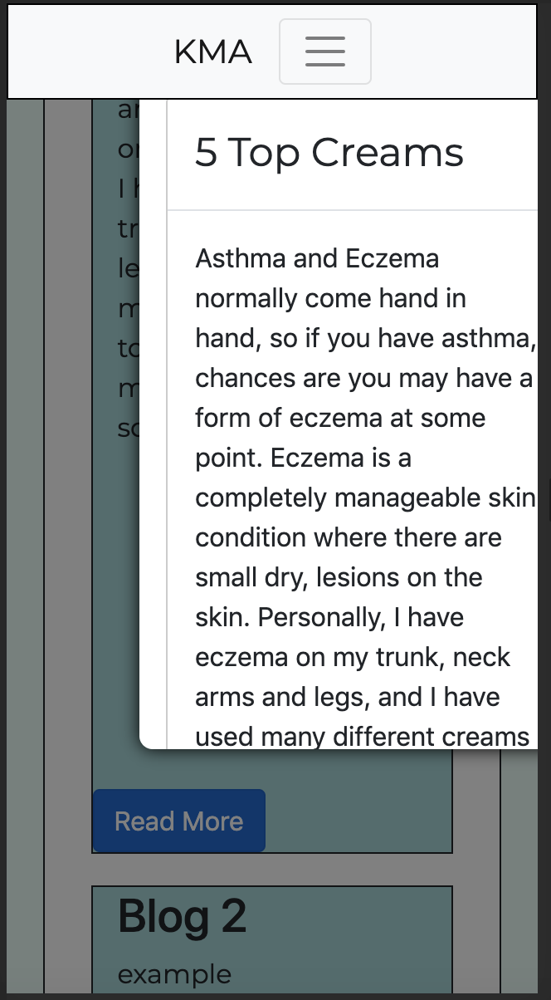

# Testing 
The testing process I did is displayed below: 
* Validating HTML/CSS/JS code
* Testing website compatibility on all browsers
* Testing website responsiveness on all devices
* Testing user stories
* Testing Signup and Contact Form Email JS manually
* Testing To Do List add and remove functions manually
* Testing links and button functionality 

[Go back to README.md here](README.md)
## Validating Code
### HTML 
To validate my html code I used [WC3 Markup Validation Service](https://validator.w3.org/). The validator shows any errors or warnings which may appear. My following errors and warnings throughout the pages were -
#### Warnings
* Type attribute is unnessecery for JS resourses
* Language attribute on the script element is obsolete
* Contentinfo role is unnecessary for element footer
#### Errors
* Stray start tag footer
#### Fixes
* Removing type attribute
* Removing language attribute from script element
* Finding stray start tag for footer
### CSS
To valiadate my css code I used [WC3 Markup Validation Service](https://validator.w3.org/). The validator shows any errors or warnings which may appear. My following errors and warnings thoughout the css page were -
#### Warnings
* No warnings
#### Errors
* Parse Error (line 493-495)
* Position: flex is not a position value (line 645)
#### Fixes
* Removing line error 493 - there was a syntax error (--)
* Adjusting position flex to a new position
### Javascript
To valiadate my Javascript I used [Beautify Tools](http://beautifytools.com/javascript-validator.php). The validator shows any errors which may appear through my code. My following errors throughout my Javascript pages were - 
#### Errors
##### contactForm.js
* 'emailjs' is not defined
* 'sendMail' is defined but never used.
##### custom-map.js
* Unnecessary semicolon line 40.
* 'marker' is defined but never used.
* 'google' is not defined.
* 'initMap' is defined but never used.
##### popUpText.js
* 'toggleText' is defined but never used.
##### readMoreModal.js
* No Syntax erros!
##### signUp.js
* 'emailjs' is not defined
* 'sendMail' is defined but never used.
##### todo.js
* Redefinition of 'close'.
* Missing semicolon line 19.
* Missing semicolon line 53.
* 'newElement' is defined but never used.
##### view.js
* Missing semicolon line 29.
* Missing semicolon line 30. 
* 'openModal' is defined but never used.
* 'closeModal' is defined but never used.
* 'plusSlides' is defined but never used.
* 'currentSlide' is defined but never used.
#### Fixes
## Testing website compatibility 
I used these four browsers to test the functionality of my website. I checked the nav, links and buttons, signup form and contact form. 
* [Google Chrome](https://developers.google.com/web/tools/chrome-devtools) - working correctly.
* [Safari](https://www.apple.com/uk/safari/) - working correctly.
* [Firefox](https://developer.mozilla.org/en-US/docs/Tools) - working correctly.
## Testing website responsiveness
I used Chrome Developer Tools to test the responsiveness of my website on screens from a small mobile device to a computer screen. 
* I checked the responsiveness of my navbar, ensuring it turned to hamburger. 
* I checked the responsiveness of my google maps and markers, ensuring it sized correctly. 
* I checked the reponsiveness of my image carousel and image viewer, ensuring it sized correctly.
* I requested friends and family to open the site on their own screen of their choice and check functionality.
* I checked the responsiveness of my pop up modals, ensuring thei fit correctly on the screen.
#### Results
* Image viewer on blogs was not responsive and the script was not correctly loading. 
* Modal viewing was not responsive on screens smaller than a tablet, the scroll was not working and the close button was not visable. See image below...

#### Changes
* I changed the sizing of the image viewer.
* I changed the modal viewing size allowing it to resize correctly, allowing scroll and close.

## Testing user-stories
Below I have included each user who has tested out the site. I have written their process taken - 
### New Users
* This user is new to the blog system and has no knowledge on asthma or it's severity. 
    * Index - Using the scroll on the mouse, they are able to easily navigate up and down the page to see content. 
    * About - Using the scroll on the mouse or up and down keys, the page is still easily naviagtable and moveable. Text is easy to read.
    * Blogs - Blogs are easy to open and close. But text is in block, may be easier to read if split. Blogs are informative and interesting.
    * To Do - Clear to do list, easy to add remove and edit elements. 
    * Contact - Easy contact form with nice email response. Maps easy to see and navigate with pointers.
"My goal was to understand the website and navigate my way to the blogs to read and contact so I can put in some comments, I found the general website very clear and consistent with easily readable text and my initial goal was easily met." 
### Existing Users
* This user is a regular blog reader who has no knowledge on asthma but understands how blogs work. 
    * Index - Home page is fun, it has an easy sign up box and a feature box which draws attention to the newest post. 
    * About - About information facts is good and easy to read. Fun user friendly caorusel as well. 
    * Blogs - Blog page is easy to use, buttons easily open and close. But the block text is hard to read.
    * To Do - Fun user friendly to do list, which is easy to use. 
    * Contact - Easy to use contact form with prompts when missed boxes occur. 
"I enjoy reading blogs and I go on many different websites to read them. This website is well structured and is a fun user friendly site. I found the way to the blog page very easily and it drew my attention to the most recent post. The sign up to receive updates on the blog was clear and precise and gave prompts if I missed something. Although the blog page was easily navigatable, the posts were hard to read as they were block text."
    